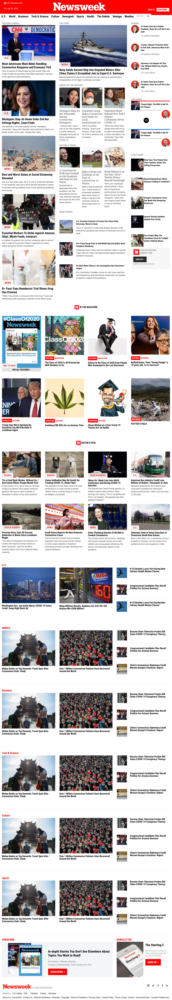

# Newsweek Homepage

> Newsweek Clone (newsweek.com)

Additional description about the project and its features.

## Building with Bootstrap and CSS frameworks

1. Adde Bootstrap boilerplate code 
2. Used Bootstrap classes where possible.
3. Applied HTML semantics and CSS standard practices.
4. Responsive layout, so it won't brake on smaller screens.

## Built With

- HTML,
- Bootstrap
- CSS,
- Git

## Live Demo

[Live Demo Link](https://happy-allen-7066bf.netlify.app)

## Getting Started

**Web browser needed**

To get a local copy up and running follow these simple example steps.

### Open browser

### Visit repository

### Download Repository (git@github.com:edieatha/newsweek.git)

### Open index.html

## Authors

👤 **Edie Atha**

- Github: [@edieatha](https://github.com/edieatha)
- Twitter: [@edieatha](https://twitter.com/edieatha)
- Linkedin: [linkedin](https://www.linkedin.com/in/edieatha/)
 Email: [email](edieatha@gmail.com)

## 🤝 Contributing

Contributions, issues and feature requests are welcome!

Feel free to check the [issues page](https://github.com/edieatha/newsweek/issues).

## Show your support

Give a ⭐️ if you like this project!

## Acknowledgments

- Hat tip to anyone whose code was used
- Inspiration
- etc

## 📝 License

This project is [MIT](lic.url) licensed.
